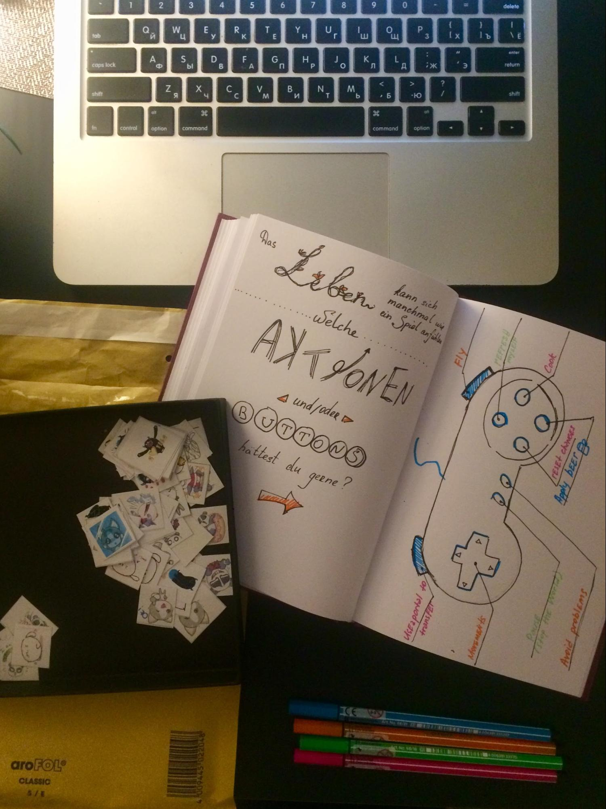
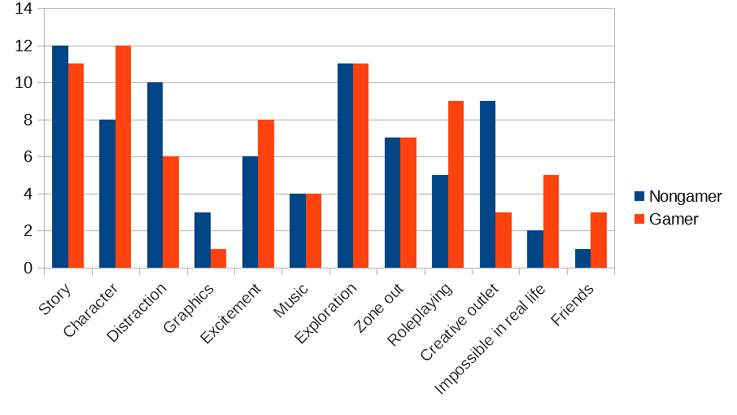
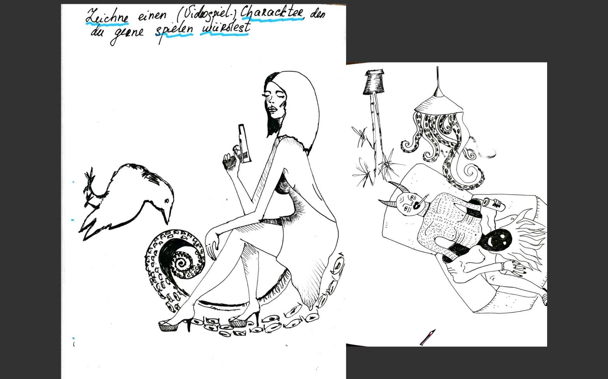
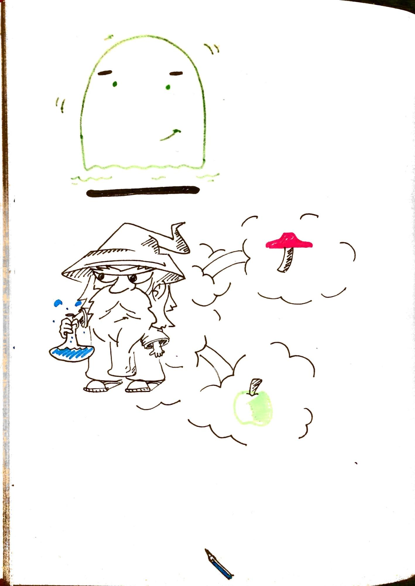

# Introduction

The idea for this project came to us after listening to a talk by Brie Code, aptly titled "Video Games are Boring" [-@code2017}. In it, she shares her examination of an interesting facet of her life: Brie is a video game developer, but her friends don't like video games. That seemed peculiar to her: Movies, Books and other media, in contrast, held more or less universal appeal. A problem she identifies is that games are made mainly by people who already enjoy and play existing games, and not often create outside of a narrow set of expectations. They (consciously or not) prioritize their interests over other (potential) audiences.

As gamers ourselves, we want to find out how to make this hobby more
appealing to a wider audience. It is a hobby we like, and we want to
share it with our friends. We acknowledge that this question has a
strong political component, especially since GamerGate and similar
campaigns tried to cement the image of the gamer as a white,
heterosexual, affluent man. Vicious attacks against people who do not
fit these criteria were carried out in order to keep them out of the
community. This means that advocacy and community management play a huge
role in making gaming more accessible. In this study, however, we will
focus on factors that are part of the games themselves; the needs
addressed, mechanics used, and others, which are in- and excluding
factors and reveal assumptions about the imagined audience.

# **Methods**

## Digital ethnography

From the very start of the research, we began to collect the information
on the topic using the digital ethnography approach. This method was
chosen as preemptive, in order to gather ideas as a starting point for
other methods and explore the problem space. This method involves the collection of information in the digital space, namely blogs, forums, news, videos and comment sections. [@ardevol2012, @postill2012] The most relevant were often found in forum threads.

During the research, we searched for suitable sources using search queries like \"games are boring\", \"do not like video games anymore\", \"loose appeal games\" and similar. During the study, more than 40 sources were found, with 30 comments on average each.

With this approach, it is possible to obtain the opinions of a large
number of people from different cultures and with various background in
a short period of time and it is not difficult to prepare such data for
further analysis.

## Autoethnography

In the beginning of the project, we wanted to reflect on our own gaming
habits. This served two main purposes. On the one hand, it could inform
further research design, inspire interview questions and the like. On
the other hand, we wanted to be aware of our motives for playing games
so we don't push them on our participants. To achieve this, we kept
track of our gaming habits over the course of a few weeks. We tried to
take notice of how much we played, when, what and why. When the same
motivations and games kept repeating, we stopped. As this step was
primarily for self-reflection, it was not formally analyzed.

## Interviews

A good chunk of our data was generated by doing semi-structured
interviews. These filled an important niche regarding depth and number
of participants. While it was impossible to reach as many people as with
a survey or by doing ethnography, we could engage with each participant
in more depth. On the flipside, they were more lightweight than probes
or similar methods that collect data over a long period of time.
Additionally, in comparison to probes, we could ask more specific and
detailed questions in interviews, where the probes were more effective
in engaging participants' creativity. [@gillham2005, @seidman2013]

We conducted nine interviews, and they were between 30 and 60 minutes in
length. Depending on the contact to the participants, there were one or
two researchers present. The interviews were conducted in a language of
the participants choice, which in practice meant German and Russian.
Each interview was or will be conducted, transcribed and analyzed by a
researcher proficient in the language spoken. The results of the
analysis and illustrative quotes were or will be translated into
English.

Participants were recruited through our social networks (online as well
as offline). They were friends, friends of friends, acquaintances from
university, neighbors and the like. This approach suggested itself, as
some of the researchers had discussed the topic with their friends
before. Additionally, we recruited through online social networks like
Facebook; and asked participants if they knew anyone who could be
interested. Our specific research question posed an unexpected challenge
for recruitment: It proved hard to find people who are explicitly
\*not\* part of a specific group. Often, we got responses from people
who didn't consider themselves to be playing a lot of video games, but
were clearly outside of our target audience, playing multiple hours
every week.

The interviews were conducted at places chosen by our participants. We tried to establish a friendly and colloquial atmosphere, since our participants were also students. Because of this shared background, it was easy and quick to set up the
dates and locations, a week in advance was often enough to schedule an
interview. The interviews were recorded with our smartphones, and the
recordings shared through a private server to protect participants'
privacy.

Unfortunately, due to time constraints, two interviews had to be
cancelled. The additional interviews would have been impossible to
transcribe and analyze, and we decided it was better not to waste
anyone's time.

## Survey

We conducted an online survey to find out about contradicting trends and
opinions in interviews, as well as inform about more widespread opinions
and beliefs about games, from non-gamers. It was conducted as a
self-hosted Lime-survey, to circumvent the issue of a third party
potentially having access to the data. The recruiting was done by
spreading the survey on our personal facebook pages, encouraging
sharing, and posting it on select communities. Some of these were gaming-related,
e.g. the Viennese Indiegamedev-Plattform and Subotron, with the plea
to spread the survey to friends and aquaintances that fit the profile and 
with the hope, that their personal stake in the hobby would motivate them
to do so.

The survey started out with some demographic questions, inquiring about
gender and age (to be answered in brackets to avoid giving away
personally identifying information), and then continued to ask about
their history with gaming (age and available platforms) and current
habits. Then, it moved on to asking about various aspects of games,
ranking them by perceived importance, and concrete reasons for not
playing games more often. Another section was dedicated to describe
their use of other media and unaddressed needs in daily life. Finally, a
free text allowed them to give personal suggestions on how to make games
more interesting.

After designing the initial set of questions, a pilot study was done
with select candidates. This process made a few issues apparent, such as
unclear questions and vocabulary; it also exposed a flaw in logic, as
participants that often played games would still be asked about why they
weren't playing games often. Fixing this turned out to be important, as
a considerable portion of participants turned out to be gamers.

We had a few goals. We wanted to find tendencies of non-gamers, both in
regard to thoughts and experiences about games, as well as other media
and leisure time activities. We hoped to find common beliefs, and
perhaps misconceptions, about games, and concrete reasons for not
playing them more often. Information about other hobbies and needs was
also sought, exploring the space available in people\'s lives, their
needs, and potentially identify common unaddressed needs (that games
could address).

Based on the interviews, there were some conflicting perspectives on
video-games from non-gamers. One example of this is the perception of
challenge, commonly suspected as a barrier of entry. In our interviews
we received responses covering the whole spectrum, some participants
stating that failure to do something is a big incentive to practice and
improve, others state losing interest, some would also get angry.
Another topic of interest is the level of activity while gaming. This
topic arose during some interviews, and while there was a tendency
towards gaming being perceived as a deliberate activity that demands
concentration, further exploration of opinions on that topic were deemed
necessary. Finding trends and the most common opinion about these topics
among non-gamers was one goal of the survey.

One last goal of the survey was to discover correlations between various
factors. Sadly, the sample size was not enough to make statistically
meaningful distinctions; with only 35 participants fully completing the
survey, testing for hypothesis was not reasonable. However, a different
opportunity became evident through the responses of apparent gamers.
This suggested a comparison of habits between gamers and non-gamers,
allowing the isolation of gamer/non-gamer-specific patterns. We hope
that focusing on these allows us to better understand the difference in
needs, and shortcomings of many current games for non-gamers.

## Design Probes

Design Probes, as invented by Bill Gaver [-@gaver1999], were a perfect fit for
our research question. Instead of being a method to collect data for
analysis, the aim of design probes is to inspire the design of an
artifact [@gaver2004]. Rather than directly asking questions like
in an interview, design probes aim to be playful and engage
participants' creativity. To this end, participants are given an
envelope full of material and activities, and are asked to complete the
activities and return everything after a time. It is crucial to design
the probes to be appropriate to the task at hand. [@graham2007]

In our case, the probe materials consisted of a partially filled-out
notebook and a few markers and stickers. Our participants should play
games, and record their experiences in the notebooks. To facilitate
creative responses, the notebooks included sections on how to draw and
make screenshots in games. Practical instructions on how to get games to
play were also included. To give the notebooks a more personal touch,
they were hand-written and illustrated by creatively competent members
of our research group. We were aiming for a personal and sketch-like
quality, inspired by Mike Rohde's sketch notes. [-@rohde2013]

It was important for us to include a variety of activities for
participants to choose from. There were straight-forward ones, like
asking the participants to note their experiences playing different
games. The traditional one-way camera was replaced by a few activities
that instructed participants to take screenshots. We tried to keep the
screenshot instructions abstract, asking for things such as "beauty" or
"fun".

Most of the activities had the goal of inspiring game design ideas.
These were a bit more creative and open than the previous ones. One of
these instructed the participants to draw a game character they would
like to play. Another one asked them for video game actions they would
like to have in real life. The third activity in this category asked
participants to set a challenge for themselves, and then record the
process of meeting it. Finally, there was a more abstract activity,
which had participants write down songs they associated with games.

Designing and preparing the probes was very time-intensive, but it was a
very fun and interesting process. The effort paid off, as the
participants really appreciated it, and responded very thoughtfully and
creatively in turn. Participants were recruited through our social
networks, as for the interviews. The probes were delivered and picked up
personally, to allow for questions and feedback. One probe is still
scheduled to return, because the participant asked for more time. It
will be used in possible follow-up projects.

# Analysis

Our qualitative data will be analyzed using Qualitative Content Analysis
(QCA), as described by Philipp Mayring [-@mayring2014]. QCA is tool for
analyzing qualitative data, such as interviews or ethnographic
documents. It aims to make the process of analysis accountable by
introducing a handful of techniques with clear rules and steps.
Additional emphasis is put on being explicit about sources of
information and including frequent steps of reflection.

In this research project, we will use QCA to analyze the data gathered
in interviews and digital ethnography. Specifically, we will use
Inductive Category Formation. This is a technique to create a system of
categories from a given text. So instead of assuming a predefined set of
answers and identifying \*where\* and \*how often\* they appear, we
primarily want to find out \*which\* answers to our questions appear.
Location and quantity will of course also be noted, but our data set is
not large enough to do any kind of meaningful quantitative analysis.
This effort will be supported by QCAmap, which is an online tool
specifically designed to support this framework of analysis. [@qcamap]

An important point for us is to use our participants' own words to
describe their experiences. In doing so, we want to minimize the
influence our preconceptions have on the results of analysis. That means
that in practice, we will try to use phrases found in the text to name
and illustrate the categories we find. Since our interviews were not
held in English, this means we have to translate the phrases we want to
use here. We hope that most of the meaning is preserved despite this,
and think it's still preferable to inventing names and examples on our
own.

Since we didn't get enough responses, we couldn't do a statistical,
quantitative analysis of our survey data. Nonetheless, we examined the
data and took note of a few interesting trends.

# Findings

Unfortunately, we experienced some scheduling troubles due to poor planning and sickness of researchers. That prevented us from analyzing the material as well as we'd liked. We still got quite a few useful insights, as detailed below.

## Preferences and Obstacles

Our participants all had in common that they currently weren\'t playing
videogames often. Some used to play a lot, but stopped due to time
constraints, others grew out of it (Paula, Elise). Paula and Agathe were
encouraged by others to try videogames again, more recently (but outside
of this study). Through those experiences, they were able to describe
very recent opinions and feelings about the issue.

A common occurrence was the introduction to gaming by siblings and
relatives. Paula stated that her first encounters were by the brother\'s
gameboy, which would lead her to later on play Nintendogs and Animal
Crossing on her Nintendo DS, Elise also used to play games on handheld
platforms such as the Gameboy, and later on, PSP. Agathe also first saw
videogames when watching her cousin play on his gameboy; she badly
wanted to try it, too, but he wouldn\'t let her.

A very common theme was that participants "grew out of" playing games.
This was to be expected considering who we tried to recruit. However, we
gathered more information on what that meant. Commonly, participants
described that other things became more interesting or that they didn't
have enough time. Time here meant playing as well as keeping up with
which games are available, for example Emile stated that he went back
and replayed games from his childhood, but was reluctant to pick up new
games. Sometimes, games were seen as frustrating and pointless; Katya
remarked that she didn't feel like she had as much perseverance as in
childhood. Additionally, she feels less emotional connection to games
now, which mirrors Brie Code's discovery that games fail to engage with
themes that are interesting to adults. (cite!)

On the topic of challenge and difficulty, we received a wide range of
opinions. For Paula, challenge was often perceived as somewhat
motivating, stating that she would sometimes start playing alone with
the explicit goal of becoming more skillful at a game. The reason behind
this was being able to overtake, or at least be equal to, her brother.
Additionally, aiming to reach the next level up in role playing games
was perceived as a big incentive to keep playing, even though otherwise
the game in question didn\'t hold a lot of appeal to her (\"this was
actually the only aspect that kept me going\"). Agathe explained that
while losing a few times was okay, \"dying again and again while I\'m
already trying my best\" was very frustrating. However, even if she
would make it through a difficult passage, this would commonly cause her
to stop playing, as those parts were draining and she didn\'t want to
play through another one. She also said that some challenge was
necessary, as a game would be boring otherwise, but at the same time
admitted to having no experience with story-focused games. The
conclusion for her seems to be that a challenge in videogames is at
worst a show stopper, and at best only tolerable. Elise described
getting very angry in the past, sometimes even throwing her handheld
system.

## Comparison of Gamers and Non-Gamers (from Survey Data)

As stated before, we ended up with only 35 full responses out of 59 who
opened the survey at all. This eliminates any statistical significance
the following observations might otherwise have. We still want to
present some patterns and trends that occured within this small sample
size, and propose hypothesis for potential future research, as comparing
the results of gamers and non-gamers lead to an array of interesting
(albeit not generalizable) insights. For the analysis below, the
following distinction was made: the sixth survey question asked
participants about how often they currently played video games. 9 people
responded with \"multiple times per week\", 1 with \"once per week\", 7
with \"a few times a month\" and 18 with \"less than once a month\". The
ones who responded with \"multiple times per week\" will be referred to
as gamers, the others as non-gamers.

The age when first playing video-games was less for gamers (median 4.5
years compared to 8 for non-gamers). Unsurprisingly, there were more
gaming platforms available to gamers at some point, the biggest
difference being consoles, while many non-gamers still have PCs, smart
phones, and to a lesser extent Gameboys. When asked what they associate
with games, gamers generally checked off most available options,
non-gamers on the other hand only rarely associated gaming with \"social
activity\", \"skill-fullness\", \"urge to discover\" and \"challenge\".
Gamers seemed to care about graphics a bit less.

To find out about participant\'s reactions to a challenge, we asked them
about how they perceived getting a game-over. Approximately thirty
percent of both gamers and non-gamers described it as \"a motivating
challenge\". On the other hand, another thirty percent of non-gamers
stated that it was \"a reason to stop playing\" (while none of the
gamers chose this response). The rest found it irrelevant.

When participants were asked why they didn't play games more often (a
question only asked for non-gamers), lack of time was one big contender
(11 participants agreeing strongly, 8 agreeing somewhat), as well as the
option "Games are not interesting" (8 agreeing strongly, 11 somewhat). 9
people (4 of which somewhat) think that games are frustrating, although
the majority disagrees to an extent. Games being too childish does not
appear to be a big issue, with only 2 participants agreeing fully, and 5
more agreeing somewhat. A few more points that did not appear to have a
negative impact for our participants where games being too stressful,
too expensive, too cumbersome to start up, or negative experiences with
gamers, all of which the majority of participants disagreed with. Two
more issues that participants did agree with were not having the
hardware (2 fully and 13 somewhat agreeing with this), although it seems
likely that this stems from their lack of interest. Finally, 7 strongly
and 5 somewhat agreed that playing games does not lead to personal
gains. Some also gave interesting manual responses, such as games being
"too abstract from the outside world", or encouraging developers to be
more creative instead of sticking to the mold.

At one point in the survey, participants were asked to rank various
aspects of a game in terms of importance. This was evaluated by weighing
the responses according to the ranks (In the table presented below, the
rankings were inverted - so the highest ranking aspect is listed as 12,
the lowest ranking as 1). Many aspects performed similarly between both
groups. However, some key differences do exist, most notable being games
as \"creative outlet\". This achieved the rank 4 of 12 for non-gamers,
while only placing on rank 10 for gamers. Roleplaying placed on rank 8
for non-gamers and rank 4 for gamers, distraction at 3 and 7, and
characters at 5 and 1. Viewing games as creative outlet could lead to
fundamental changes in game design, suggesting different genres and
novel approaches to cover a need not commonly addressed in AAA games.
Roleplaying being a less prevalent aspect of gaming suggests that
non-gamers are looking for less of an escape into a fantasy; distraction
on the other hand could potentially imply that non-gamers don\'t take it
as serious.

When analysing the common use of other media, only few differences were
found between gamers and non-gamers, aside from consistently checking
gaming/leaving it unchecked. However, watching TV-series when bored was
rather common for non-gamers (73%, 19 of 26), while somewhat rarer for
gamers (44%, 4 of 9). Also, non-gamers more commonly use music, books
and social media for self expression (53% / 22%, 23% / 11%, 46%/22%).
Situations for playing videogames were relatively evenly distributed
among gamers, while non-gamers barely thought of it as a social activity
(averaging 20% for the other situations but only 8% for social
situations).

A question about the level of physical or mental activity during various
pastimes, as inspired by interview questions, lead to surprising
results. For most media, the rank of activity was judged similarly
between gamers and non-gamers (level of activity in descending order:
listening to music, reading a book, watching a series, watching a
movie). Games however, were judged as the most active by gamers, and the
least active by non-gamers. Social media on the other hand was ranked
rather high by non-gamers, while it was ranked lowest by gamers.

Finally, when asked about unaddressed needs in their daily life, gamers
and non-gamers gave very similar responses. Lack of relaxation is the
most common, while opportunities for self expression, creative outlets,
and satisfaction of curiosity were also commonly picked.

## Implications for design

After conducting the interview and getting the results of Probes, we
analyzed Total statements and wishes of non-gamers to existing games. On
the basis of these statements and the designed graphic materials, it is
possible to create a concept game, which could engage this audience.

In the interview, some participants noted that they would be sympathetic
to games in which the protagonists face quite real difficulties and have
a similarity with ordinary people, thus reminding the players
themselves.

One of the tasks in probes was to create own character, which the
participant of the study would like to play. 2 out of 3 participants
created characters of human resemblance with a superpower, which
shape-appearance changing ability.

Participant number 1 created the concept of the action-adventure game,
the main character of which is a creature that plays the role of a spy.
The player himself creates a human image of his character (based on
wishes, the participants of the research find the process of creating a
character exciting and responsible). The game involves the espionage
missions, the success of which depends on the produced transformation
and the ability to adapt to external circumstances. (Figure 5)

Participant number 2 has created a concept of a platform game, the main
character of which is the magician. Depending on the specific nature of
the task, he can change appearance into non-living objects. (Figure 6)

# Conclusions and future work

While not all went according to plan, we still learned a lot. The amount
of time it takes to transcribe and analyze all the collected data took
us by surprise. Combined with unlucky circumstances, this put us in a
bit of time pressure. This is something we will take more seriously in
future work.

An interesting follow-up project would be to take the inspiration and
data gathered here, and actually implement one (or a few) game
prototypes based on that. It would be very interesting indeed to see if
those would be interesting to people who feel alienated by the currently
available games. This is something a few of our researchers are interested in doing, so stay tuned!

# Acknowledgements

We'd like to thank Irene, who went out of her way to support us when we
had troubles. Specifically, she took time to discuss the concept with us
and was very patient when we had problems with finishing in time.

Additionally, we'd like to thank our participants. We learned a lot from
this project, both about conducting research and the topic itself. That
wouldn't have been possible without our participants' generous
contribution of their time and thoughts.

# References
